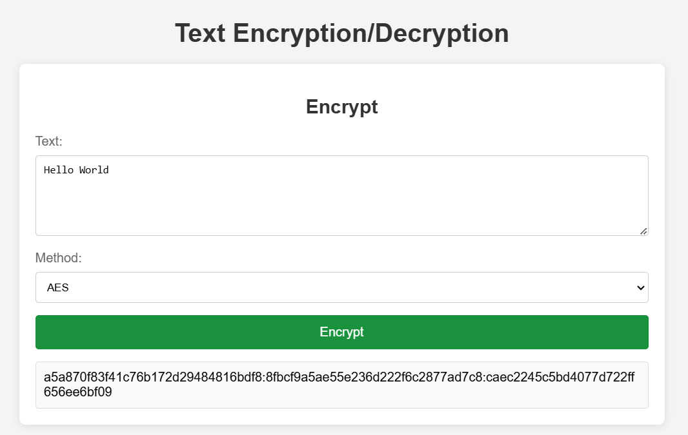
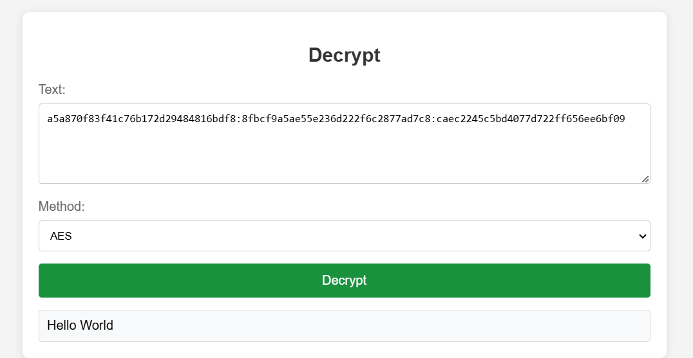
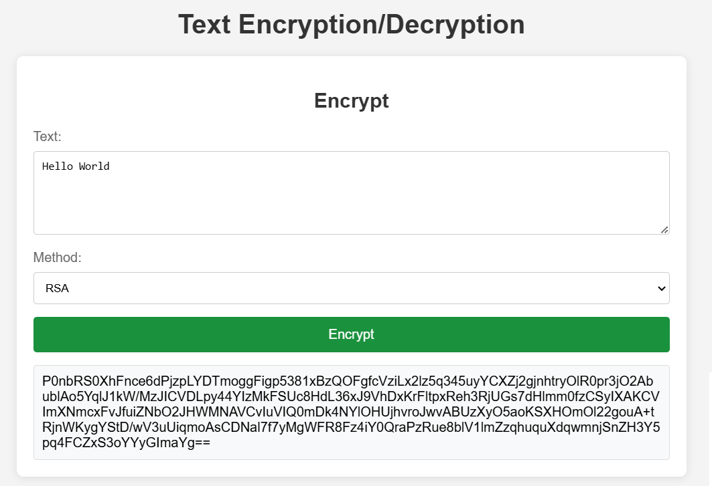
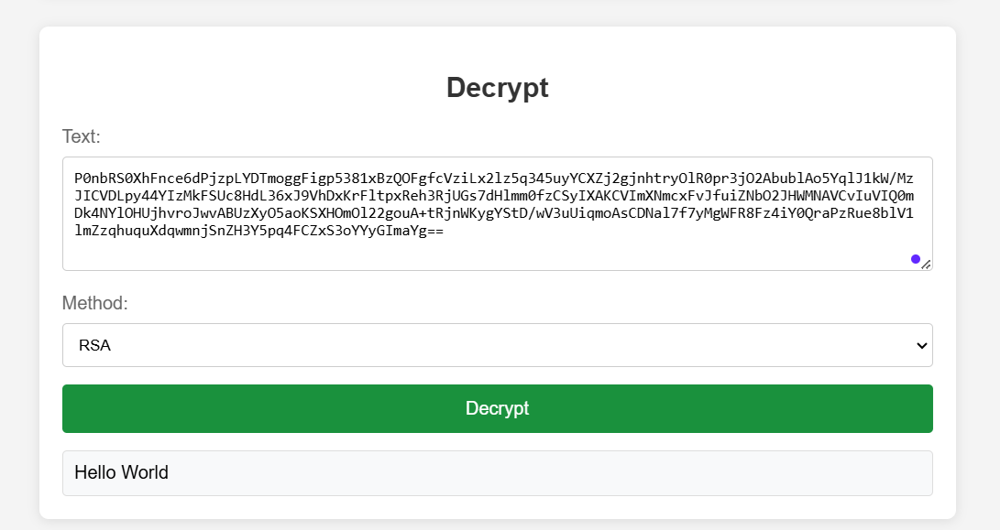

# Cryptography Algorithms App Documentation

## Table of Contents
1. [Project Overview](#project-overview-)
2. [Installation](#installation-)
3. [Usage](#usage-)
4. [Encryption Algorithms](#encryption-algorithms-)
5. [Examples](#examples-)


## Project Overview 📝
The Cryptography Algorithms App is a web-based application that provides text encryption and decryption capabilities using two industry-standard encryption algorithms: AES (Advanced Encryption Standard) for symmetric encryption and RSA (Rivest-Shamir-Adleman) for asymmetric encryption. The application features a clean, user-friendly interface for secure text processing.

## Installation ⚙️
To install and run the Cryptography Algorithms App, follow these steps:

1. Install the required dependencies:
```bash
npm install
```

2. Launch the application:
```bash
node app.js
```

The server will start running on port 3000 (default) or your specified port.

## Usage 📖
1. Access the application through your web browser at `http://localhost:3000`
2. The interface provides two main sections:
   - **Encryption Form**
     - Enter the text you want to encrypt
     - Select encryption method (AES or RSA)
     - Click "Encrypt" button
   - **Decryption Form**
     - Enter the encrypted text
     - Select the same method used for encryption
     - Click "Decrypt" button

3. The application will display:
   - The encryption/decryption result in the output area
   - Any error messages in a separate error output area

## Encryption Algorithms 🔐

### AES Implementation
The application uses AES-256-CBC (Advanced Encryption Standard with Cipher Block Chaining), one of the most secure symmetric encryption algorithms available.

#### Algorithm Details
- **Block Size**: 128 bits (16 bytes)
- **Key Size**: 256 bits (32 bytes)
- **Mode**: Cipher Block Chaining (CBC)
- **Rounds**: 14 transformation rounds

#### Key Security
- 32-byte encryption key (stored in environment variables)
- 16-byte random salt for each encryption
- PBKDF2 key derivation with:
  - 100,000 iterations
  - SHA-256 hash function
  - 32-byte derived key length

#### Core Operations (per round -> 14)
1. **SubBytes Transformation**
   - Each byte is replaced using a substitution table (S-box)
   - Provides non-linearity in the cipher
   - Helps prevent differential cryptanalysis

2. **ShiftRows Operation**
   - Bytes in each row are cyclically shifted left
   - Row 0: No shift
   - Row 1: Shift 1 position left
   - Row 2: Shift 2 positions left
   - Row 3: Shift 3 positions left

3. **MixColumns Transformation**
   - Each column is multiplied by a fixed polynomial
   - Provides diffusion in the cipher
   - Mixes data within columns for better security
   - It's not maintained for the last round

4. **AddRoundKey**
   - Round key is XORed with current block
   - Combines subkey with data block
   - Different key used in each round

### RSA Implementation

#### Key Features
- 2048-bit key size
- Generated on server start
- Base64 encoded output

#### Mathematical Foundation
1. **Key Generation**
   ```plaintext
   1. Select two prime numbers: p and q
   2. Calculate n = p × q
   3. Calculate φ(n) = (p-1) × (q-1)
   4. Choose e where 1 < e < φ(n) and gcd(e, φ(n)) = 1
   5. Calculate d where d × e ≡ 1 (mod φ(n))
   ```

2. **Public Key**
   - Consists of (n, e)
   - Typically e = 65537 (2¹⁶ + 1)
   - n is the modulus (2048 bits)

3. **Private Key**
   - Consists of (n, d)
   - d is kept secret
   - Used for decryption

#### Encryption Process
```plaintext
For message M:
Ciphertext = M^e mod n
```

#### Decryption Process
```plaintext
For ciphertext C:
Message = C^d mod n
```

## Examples 📌

### AES Encryption/Decryption
Input:
```
Hello World
```

Encrypted Output (format):
```
a5a870f83f41c76b172d29484816bdf8:8fbcf9a5ae55e236d222f6c2877ad7c8:caec2245c5bd4077d722ff656ee6bf09
```

<p align="center">
  
  <br>
  <em>Example 1: AES Encryption</em>
</p>

<p align="center">
  
  <br>
  <em>Example 2: AES Decryption</em>
</p>


### RSA Encryption/Decryption
Input:
```
Hello World
```

Encrypted Output:
```
P0nbRS0XhFnce6dPjzpLYDTmoggFigp5381xBzQOFgfcVziLx2lz5q345uyYCXZj2gjnhtryOlR0pr3jO2AbublAo5YqlJ1kW/MzJICVDLpy44YIzMkFSUc8HdL36xJ9VhDxKrFltpxReh3RjUGs7dHlmm0fzCSyIXAKCVImXNmcxFvJfuiZNbO2JHWMNAVCvIuVIQ0mDk4NYlOHUjhvroJwvABUzXyO5aoKSXHOmOl22gouA+tRjnWKygYStD/wV3uUiqmoAsCDNal7f7yMgWFR8Fz4iY0QraPzRue8blV1lmZzqhuquXdqwmnjSnZH3Y5pq4FCZxS3oYYyGImaYg==
```

<p align="center">
  
  <br>
  <em>Example 3: RSA Encryption</em>
</p>

<p align="center">
  
  <br>
  <em>Example 4: RSA Decryption</em>
</p>

### Error Handling Examples
The application handles various error scenarios:

1. Missing Input:
```json
{
    "error": "Text is required."
}
```

2. Invalid Encryption Method:
```json
{
    "error": "Invalid encryption method."
}
```

3. Invalid AES Format:
```json
{
    "error": "AES decryption error: Invalid encrypted text format."
}
```

4. Invalid RSA Data:
```json
{
    "error": "RSA decryption error: Invalid RSA encrypted text."
}
```

Current Security Measures:
- HTTP security headers via Helmet
- Input validation
- Secure key derivation
- Random IV and salt generation
- Error messages that don't expose internal details
- Environment variable for sensitive data

Note: This documentation reflects the current implementation. Some features mentioned in the original documentation (like GCM mode, rate limiting, and request size limits) are not currently implemented in the codebase.
